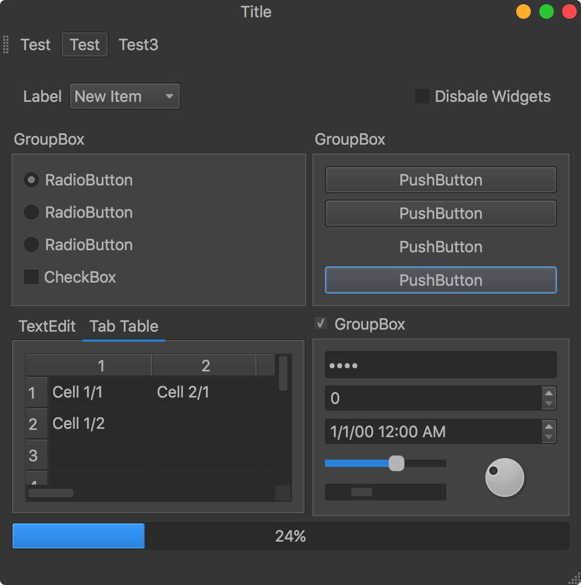

========
qtmodern
========

.. image:: https://travis-ci.org/gmarull/qtmodern.svg?branch=master
    :target: https://travis-ci.org/gmarull/qtmodern
    :alt: Travis build

.. image:: https://img.shields.io/pypi/v/qtmodern.svg
    :target: https://pypi.python.org/pypi/qtmodern
    :alt: PyPI Version

``qtmodern`` is a Python package aimed to make PyQt/PySide applications look
better and consistent on multiple platforms. It provides a custom frameless
window and a dark theme. In order to be compatible with multiple Python Qt
wrappers `QtPy <https://github.com/spyder-ide/qtpy>`_ is used. The initial idea
comes from `this project <https://github.com/Jorgen-VikingGod/Qt-Frameless-Window-DarkStyle>`_.

Installation
------------

The recommended way to install is by using ``pip``, i.e::

    pip install pyqt5 qtmodern

Usage
-----

In order to use ``qtmodern``, simply apply the style you want to your
application and then, create a ``ModernWindow`` enclosing the window you want to
*modernize*::

    import sys
    import qtmodern.styles
    import qtmodern.windows
    from PyQt5.QtWidgets import QApplication, QWidget
    
    ...

    app = QApplication(sys.argv)
    win = QWidget()

    qtmodern.styles.dark(app)
    mw = qtmodern.windows.ModernWindow(win)
    mw.show()

    ...

